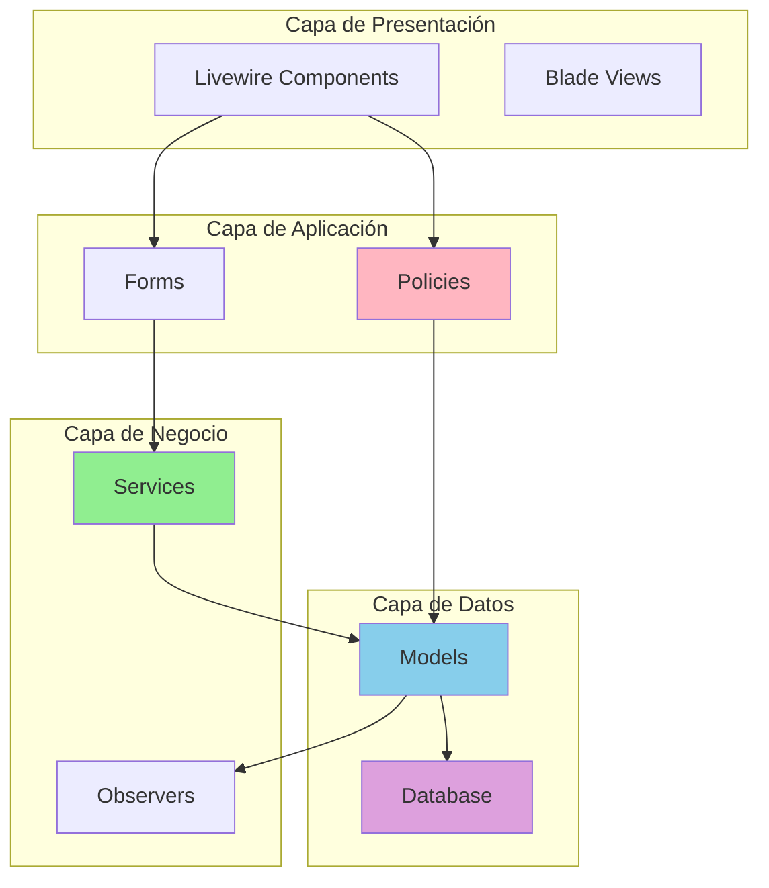
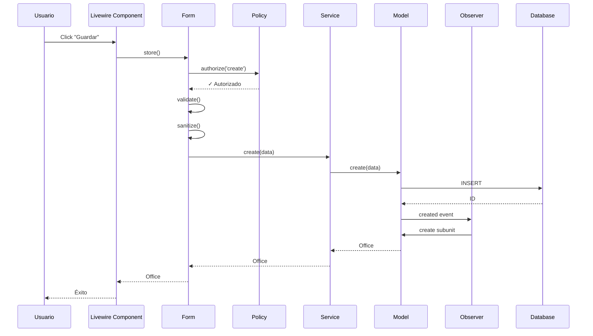
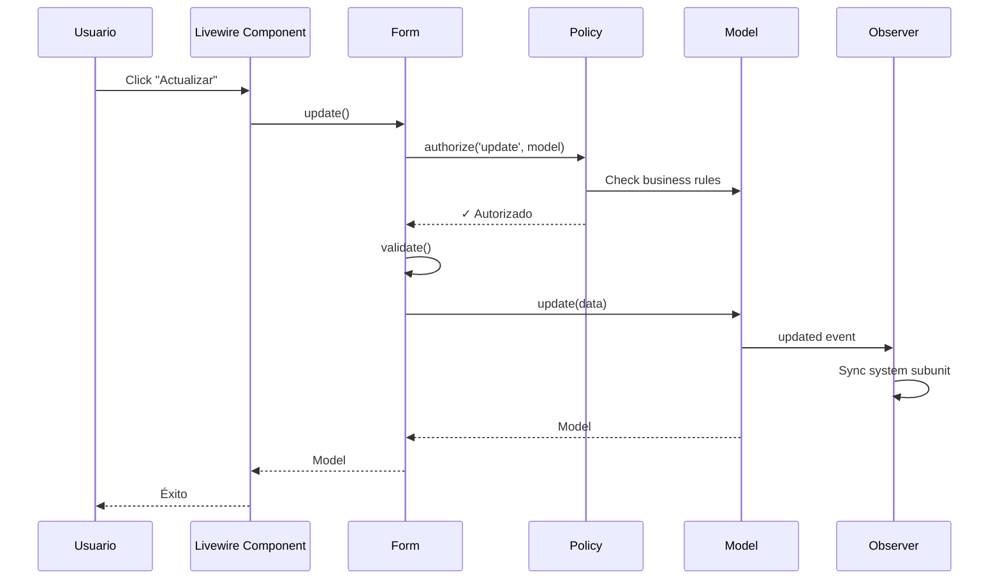
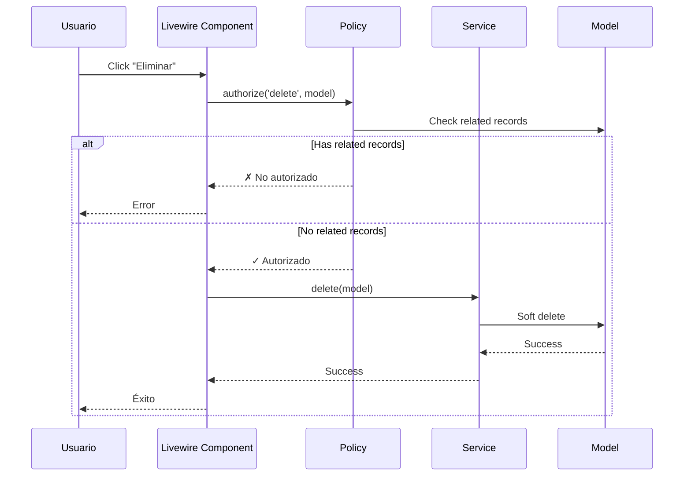
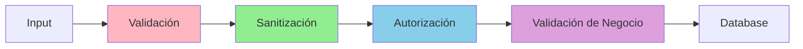

# Arquitectura del Sistema de Gestión Presupuestal

## 📐 Visión General

Este documento describe la arquitectura del sistema de gestión presupuestal, implementado con Laravel 12, Livewire 3, y siguiendo principios SOLID y patrones de diseño modernos.

---

## 🏗️ Capas de la Aplicación

El sistema está organizado en 4 capas principales, cada una con responsabilidades bien definidas:



### 1. Capa de Presentación

**Responsabilidad:** Interacción con el usuario

**Componentes:**

-   **Livewire Components:** Manejan la lógica de UI y eventos
-   **Blade Views:** Renderizado de HTML

**Ejemplo:**

```php
// resources/views/livewire/catalogs/office/index.blade.php
class Index extends Component
{
    public function save()
    {
        $this->form->store(); // Delega a la capa de aplicación
    }
}
```

### 2. Capa de Aplicación

**Responsabilidad:** Orquestar operaciones y validar permisos

**Componentes:**

-   **Forms (BaseForm):** Validación, normalización, sanitización
-   **Policies:** Autorización y control de acceso

**Ejemplo:**

```php
// app/Livewire/Forms/OfficeForm.php
class OfficeForm extends BaseForm
{
    public function store(): Model
    {
        $this->authorize('create');  // ← Policy
        $this->validate();           // ← Validación
        $this->sanitize();           // ← Seguridad
        return parent::store();      // ← Delega a Service
    }
}
```

### 3. Capa de Negocio

**Responsabilidad:** Lógica de negocio compleja

**Componentes:**

-   **Services:** Operaciones complejas que involucran múltiples modelos
-   **Observers:** Reacciones automáticas a eventos del modelo

**Ejemplo:**

```php
// app/Services/OfficeService.php
class OfficeService
{
    public function delete(Office $office): bool
    {
        // Validación de negocio
        if ($office->officeBudgetAssignments()->exists()) {
            throw new Exception('...');
        }

        // Operación en transacción
        DB::transaction(function() use ($office) {
            $office->subunits()->delete();
            $office->delete();
        });
    }
}
```

### 4. Capa de Datos

**Responsabilidad:** Acceso y persistencia de datos

**Componentes:**

-   **Models:** Representación de entidades y relaciones
-   **Database:** Almacenamiento persistente

**Ejemplo:**

```php
// app/Models/Office.php
class Office extends Model
{
    // Scopes para queries reutilizables
    public function scopeActive($query)
    {
        return $query->where('is_active', true);
    }

    // Relaciones
    public function subunits()
    {
        return $this->hasMany(Subunit::class);
    }
}
```

---

## 🔄 Flujo de Datos

### Flujo de Creación (Create)



**Explicación paso a paso:**

1. **Usuario** hace click en "Guardar"
2. **Livewire Component** llama a `form->store()`
3. **Form** verifica autorización con **Policy**
4. **Form** valida datos según reglas
5. **Form** sanitiza datos (XSS protection)
6. **Form** delega a **Service** (opcional, puede ir directo a Model)
7. **Service** crea el **Model**
8. **Model** se guarda en **Database**
9. **Observer** reacciona al evento `created`
10. **Observer** crea subunidad automáticamente
11. Respuesta exitosa al usuario

### Flujo de Actualización (Update)



### Flujo de Eliminación (Delete)



---

## 🎨 Patrones de Diseño Utilizados

### 1. Service Layer Pattern

**Problema:** Lógica de negocio compleja en Controllers/Forms

**Solución:** Centralizar lógica en Services reutilizables

**Implementación:**

```php
// ❌ Antes: Lógica en Form
class OfficeForm extends Form
{
    public function store()
    {
        $office = Office::create($this->getData());
        $office->subunits()->create([...]);
        if ($office->budget > 1000000) {
            // lógica compleja...
        }
    }
}

// ✅ Después: Lógica en Service
class OfficeService
{
    public function create(array $data): Office
    {
        return DB::transaction(function() use ($data) {
            $office = Office::create($data);
            $this->createSystemSubunit($office);
            $this->validateBudgetLimits($office);
            return $office;
        });
    }
}
```

**Beneficios:**

-   ✅ Reutilizable desde Forms, Commands, Jobs
-   ✅ Fácil de testear
-   ✅ Lógica centralizada

### 2. Policy Pattern

**Problema:** Autorización dispersa por todo el código

**Solución:** Centralizar reglas de autorización en Policies

**Implementación:**

```php
// app/Policies/OfficePolicy.php
class OfficePolicy
{
    public function delete(User $user, Office $office): bool
    {
        if (!$user->can('delete offices')) {
            return false;
        }

        // Lógica de negocio
        return !$office->officeBudgetAssignments()->exists();
    }
}

// Uso en Form
$this->authorize('delete', $office);
```

**Beneficios:**

-   ✅ Autorización centralizada
-   ✅ Combina permisos + lógica de negocio
-   ✅ Fácil de auditar

### 3. Template Method Pattern

**Problema:** Código duplicado en Forms

**Solución:** BaseForm con hooks extensibles

**Implementación:**

```php
// BaseForm define el flujo
abstract class BaseForm extends Form
{
    public function store(): Model
    {
        $this->beforeValidation();  // ← Hook
        $this->validate();
        $this->beforeSave();        // ← Hook
        $model = $this->create();
        $this->afterSave($model);   // ← Hook
        return $model;
    }
}

// Forms hijos sobrescriben solo lo necesario
class OfficeForm extends BaseForm
{
    protected function beforeSave(): void
    {
        // Lógica específica de Office
    }
}
```

**Beneficios:**

-   ✅ DRY (Don't Repeat Yourself)
-   ✅ Flujo consistente
-   ✅ Fácil de extender

### 4. Observer Pattern

**Problema:** Lógica acoplada al guardar modelos

**Solución:** Observers que reaccionan a eventos

**Implementación:**

```php
// app/Observers/OfficeObserver.php
class OfficeObserver
{
    public function created(Office $office): void
    {
        // Crear subunidad automáticamente
        $office->subunits()->create([...]);
    }

    public function updated(Office $office): void
    {
        // Sincronizar subunidad si cambió el nombre
        if ($office->wasChanged('name')) {
            $this->syncSystemSubunit($office);
        }
    }
}
```

**Beneficios:**

-   ✅ Separación de concerns
-   ✅ Reacciones automáticas
-   ✅ Código desacoplado

### 5. Repository Pattern (Scopes)

**Problema:** Queries repetidas en múltiples lugares

**Solución:** Scopes en Models

**Implementación:**

```php
// Model
class Office extends Model
{
    public function scopeActive($query)
    {
        return $query->where('is_active', true);
    }

    public function scopeSearch($query, $term)
    {
        return $query->where('name', 'like', "%{$term}%")
                    ->orWhere('code', 'like', "%{$term}%");
    }
}

// Uso
Office::active()->search('RRHH')->get();
```

**Beneficios:**

-   ✅ Queries reutilizables
-   ✅ Código expresivo
-   ✅ Fácil de mantener

---

## 🔐 Seguridad - Defense in Depth

El sistema implementa múltiples capas de seguridad:



### Capa 1: Validación de Entrada

```php
'email' => 'required|email:rfc,dns'
'password' => Password::min(8)->mixedCase()->numbers()
```

### Capa 2: Sanitización

```php
$data = strip_tags($data); // Eliminar HTML
```

### Capa 3: Autorización

```php
Gate::authorize('update', $office);
```

### Capa 4: Validación de Negocio

```php
if ($office->subunits()->exists()) {
    throw new Exception('...');
}
```

---

## ⚡ Performance - Optimizaciones

### 1. Índices de Base de Datos

```sql
-- Índices compuestos para filtrado
CREATE INDEX offices_active_code_idx ON offices(is_active, code);

-- Índices de búsqueda
CREATE INDEX offices_name_idx ON offices(name);
```

### 2. Eager Loading

```php
// ❌ N+1 Problem
$offices = Office::all();
foreach ($offices as $office) {
    $office->subunits; // Query por cada office
}

// ✅ Eager Loading
$offices = Office::with('subunits')->get(); // Solo 2 queries
```

### 3. Query Scopes

```php
// Queries optimizadas y reutilizables
Office::active()
    ->withSubunitsCount()
    ->orderByCode()
    ->get();
```

---

## 📊 Decisiones Arquitectónicas

### ¿Por qué Service Layer?

**Decisión:** Implementar Services para lógica compleja

**Razones:**

1. Separar lógica de negocio de Forms
2. Reutilizar desde múltiples puntos (Forms, Commands, Jobs)
3. Facilitar testing con mocking

**Trade-offs:**

-   ➕ Código más organizado
-   ➕ Fácil de testear
-   ➖ Más archivos (complejidad inicial)

### ¿Por qué Policies en lugar de Gates?

**Decisión:** Usar Policies para autorización

**Razones:**

1. Organización por modelo
2. Combinar permisos + lógica de negocio
3. Auto-discovery de Laravel

**Trade-offs:**

-   ➕ Código organizado
-   ➕ Fácil de encontrar
-   ➖ Más verboso que Gates simples

### ¿Por qué Observers?

**Decisión:** Usar Observers para operaciones automáticas

**Razones:**

1. Desacoplar lógica de creación de subunidades
2. Reaccionar a eventos del modelo
3. Mantener sincronización automática

**Trade-offs:**

-   ➕ Código desacoplado
-   ➕ Automático
-   ➖ Puede ser "mágico" (no obvio)

---

## 🔮 Futuras Mejoras

### Corto Plazo

-   [ ] Implementar caché para catálogos
-   [ ] Agregar middleware de usuario activo
-   [ ] Crear helpers reutilizables

### Mediano Plazo

-   [ ] Implementar eventos y listeners
-   [ ] Agregar queue para operaciones pesadas
-   [ ] Implementar API REST

### Largo Plazo

-   [ ] Microservicios para módulos independientes
-   [ ] Event Sourcing para auditoría
-   [ ] CQRS para separar lectura/escritura

---

## 📚 Referencias

-   [Laravel Documentation](https://laravel.com/docs)
-   [Livewire Documentation](https://livewire.laravel.com/docs)
-   [SOLID Principles](https://en.wikipedia.org/wiki/SOLID)
-   [Design Patterns](https://refactoring.guru/design-patterns)
